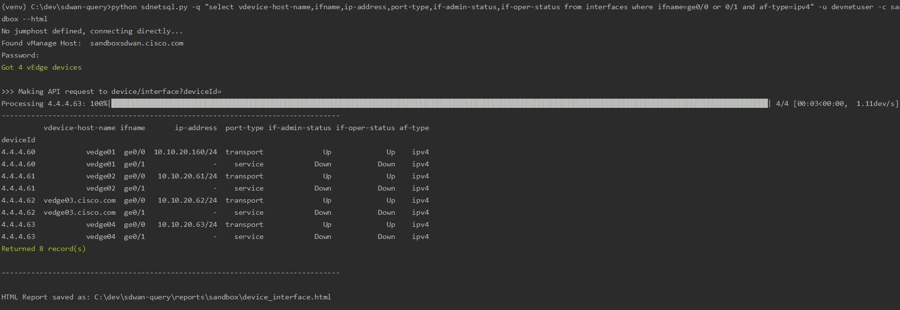

[](https://www.python.org/downloads/)
[](https://lbesson.mit-license.org/)
# Cisco SD-WAN Query Tool

This tool allows to perform SQL-like queries on Cisco vManage controller, like this:
```
select src-ip,dst-ip,color,state from bfd_sessions where state = up
```
You can query vManage as it was a SQL database and get custom details/reports from a single or all managed devices which is not currently available via vManage GUI. 

Simple examples :
```
python sdnetsql.py -q "select peer-addr,as from bgp_sessions where state=established" --user=user-a --customer=cust-a --html
python sdnetsql.py -q "select vdevice-host-name,ifname,ip-address,port-type,if-admin-status,if-oper-status from interfaces where vdevice-host-name=jc7003edge01 and af-type=ipv4" --user=user-a --customer=cust-a --html
```



You can easily define your own Data Source based on vManage API and start querying it.

- [Cisco SD-WAN Query Tool](#cisco-sd-wan-query-tool)
  * [Installation](#installation)
  * [How it works](#how-it-works)
  * [How to use it](#how-to-use-it)
  * [Queries](#queries)
      - [Data Sources](#data-sources)
      - [Fields and Conditions](#fields-and-conditions)
      - [Examples](#examples)
  
## Installation

It is recommended to build a Python 3 virtual environment. 
Details on how to set one up can be found [here](https://docs.python.org/3/library/venv.html). 

If you use a Windows PC, follow these steps:
1. Download and install [python 3](https://www.python.org/downloads/)
2. Setup virtual environment 
3. Activate it
4. Download source code
5. Install requirements
6. Start querying your network or use -h for help

Windows:
```
python -m venv <path>
<path>\Scripts\activate.bat
git clone https://github.com/supro200/cisco-sdwan-query-tool.git
cd cisco-sdwan-query-tool
pip install -r requirements.txt
python sdnetsql.py -h
```
Linux:
```
sudo apt-get update
sudo apt install python3 python3-pip python3-venv
git clone https://github.com/supro200/cisco-sdwan-query-tool
cd cisco-sdwan-query-tool/
python3 -m venv .
source bin/activate
pip3 install -r requirements.txt
python3 sdnetsql.py -h
```

## How it works

The script connects to vManage API, converts the data received to CSV files, and then processes them as Pandas dataframes.
The results are device-command specific CSV files, and optionally HTML report.

When processing data, the script uses/creates the following directories:

>**raw_data/customer/datasource** - raw CSV files
>
>**reports/customer/datasource**  - processed CSV files and HTML reports

If *--html-output option* is selected, the .html files are places in **reports/**

Possible data sources to query and the corresponding API are defined in **datasource.json** and vManage controllers in **customers.json** 

See below for more details.

## How to use it

Use the following CLI parameters:

Required:

> *'-q', '--query'*        - SQL-formatted query, see examples below
>
> *'-c', '--customer'*     - Customer name
>
> *'-u', '--user'*         - Username to connect to vManage

Optional:

> *--no-connect*, *-nc* - Run without connecting to network devices, processes the command output already collected.
>                This is useful after you run a query, already got output, and then need to query on different fields or conditions; or don't have access to network devices.
>                Considerably improves query processing time, as it simply processes text files, but doesn't retrieve realtime information
>
>  *--screen-output* - Prints report to screen. CSV reports are always generated. Default is On.
>
>  *--screen-lines*  - Number of lines printed to screen. Full output is always printed to CSV files. Default is 30.
>
>  *--html-output*, *-html*   - Prints report to HTML. CSV reports are always generated. Default is off.
>
>  *--report-dir*, *-dir*   - Directory for reports. If not specified, a new directory will be created in format YYYY-MM-DD. 
>                             This can be used for comparing output of the same command, for example before and after making network changes.
>                             Please see *network-snapshot.txt* as an example
>  *--password*, *-p*  - Password. If not given, you'll be asked to enter it when run the script. 
>                                  Note: if you access vManage via a jumphost, the same password will be used for both devices.  

### CLI Parameter: Customer 

Required in *--customer* CLI option

Used to retrieve _vmanage_ip_ and _jump_host_ value for from **customers.json** file

The tool can use multiple vManage controller belonging to different customers which can be defined **customers.json** 
The customer record format is:

    {
    "customer": "customera",                      <<<<<<  customer name, used in CLI, mandatory item
    "vmanage_ip": "10.121.136.20",                <<<<<<  vManage IP to connect, mandatory item
    "vmanage_fqdn": "vmanage.customera.com",      <<<<<<  vManage FQDN, currently not in use
    "jump_host": "jumphost01.mgmt.local"          <<<<<<  Optional Jumphost if vManage is not reachable directly 
    },

You can have a single vManage controller, in this case **customers.json** will contain a single record describing your vManage controller.

### CLI Parameter: Username 

Required in *--user* CLI option

Password should be entered manually each time the script runs.

## Queries

The query should be in the following format:
```
select <fields> from <data_source> where <conditions>
```
*data_source*, *fields* and *conditions* are described below, following by examples.

#### Data Sources

Data Source is used in queries in **from** clause, for example:
```
select * from <datasource>
```
You can add a new Datasource to file **datasources.json**, and start querying it.

The Data source definition format:
```
    {
    "data_source":  "bgp_sessions",                   <<<<<<  arbitrary datasource name      
    "api_mount": "device/bgp/neighbors?deviceId="     <<<<<<  actual vManage REST API endpoint
   }
```
**datasources.json** defines the actual vManage API endpoins and currently only supports API requests containing ?deviceId= part. 
See the list of supported API endpoints at https://vManage-IP/apidocs/

#### Fields and Conditions

The simplest way to query a Data Source is to use * as Field and don't use any conditions, for example:
```
select * from <data_source> 
```
Using * you can find all the fields you can query or filter on.

In most cases, however, you may want to define conditions with **where** clause:
```
select <fields> from <data_source> where <conditions>
```
There can be a single condition, for example:
```
where deviceId = 3.1.79.1
where state = established
```
Or multiple conditions separated by keyword **and**:
```
where state = up and color = mpls
```

It is also possible to specify multiple values for a condition with keyword **or**

For example: 
```
where state = up and color = mpls or lte
where index = 0 or 1 or 2 or 3 and deviceId = 3.1.125.1
where ifname=ge0/4 or ge0/3
```

You can query all vEdge devices, or only a set of them using *deviceId* , *host-name*  or  *site-id* leveraging **where** condition 

Note *host-name* matches a substing, so the condition below will return data from devices containing 2070 or branch in hostnames:
```
host-name = 2070 or branch or syd
```

Query by site-id or deviceId:
```
where site-id = 220 or 183 or 228
deviceId = 3.1.125.1
```

#### Examples 

To get started, use a simple query like this:

```
python sdnetsql.py -q "select * from bfd_sessions where state = up" -u usera -c customera --html
```
This query will return all active BFD sessions from all devices.
There might be too many fields returned, so modify the query, include only interesting fields:
```
python sdnetsql.py -q "select src-ip,dst-ip,color,state from bfd_sessions" -u usera -c customera --html
```
Next, add a condition _where state = up_ which returns only active BFD sessions:
```
python sdnetsql.py -q "select src-ip,dst-ip,color,state from bfd_sessions where state = up" -u usera -c customera --html
```
Add an additional condition to the previous example _and deviceId = 3.1.25.1_ and retrieve active BFD sessions from a particular device:
```
python sdnetsql.py -q "select src-ip,dst-ip,color,state from bfd_sessions where state = up and deviceId = 3.1.25.1" -u usera -c customera --html
```
The same query, but query devices by a part of hostname:
```
python sdnetsql.py -q "select src-ip,dst-ip,color,state from bfd_sessions where state = up and host-name = 2070 or 4011" -u usera -c customera --html
```

Similarly, query any other sources you define in *datasources.json* file.

Get OMP sessions state:
```
python sdnetsql.py -q "select * from omp_peers" -u usera -c customera --html
```
Interface State:
```
python sdnetsql.py -q "select deviceId,vdevice-host-name,ifname,ip-address,port-type,if-admin-status,if-oper-status from interfaces " -u usera -c customera --html
```
The previous query return IPv6 and IPv4 interfaces, get IPv4 interfaces only:
```
python sdnetsql.py -q "select deviceId,vdevice-host-name,ifname,ip-address,port-type,if-admin-status,if-oper-status from interfaces " -u usera -c customera --html
```
Query only specific device:
```
python sdnetsql.py -q "select vdevice-host-name,ifname,ip-address,port-type,if-admin-status,if-oper-status from interfaces where vdevice-host-name=jc7003edge01 and af-type=ipv4" -u usera -c customera --html
```
Query only IPSec interfaces status:
```
python sdnetsql.py -q "select vdevice-host-name,ifname,ip-address,port-type,if-admin-status,if-oper-status from interfaces where ifname=ipsec and af-type=ipv4" -u usera -c customera --html
```
Query latest IP SLA data (interval 0) - if you have hub-and-spoke topology, query the hub device to get all spoke SLA data
```
python sdnetsql.py -q "select vdevice-name,remote-system-ip,local-color,remote-color,mean-latency,loss,mean-loss,mean-jitter,average-jitter,vdevice-name,local-color,remote-color,mean-latency,loss,mean-loss,mean-jitter,average-jittervdevice-name,remote-system-ip,local-color,remote-color,mean-latency,loss,mean-loss,mean-jitter,average-jitter from sla_stat where index = 0 and deviceId = 3.1.1.1 " -u usera -c customera --html
```
Query three latest IP SLA data (intervals 0 or 1 or 2)
```
python sdnetsql.py -q "select vdevice-name,remote-system-ip,local-color,remote-color,mean-latency,loss,mean-loss,mean-jitter,average-jitter,vdevice-name,local-color,remote-color,mean-latency,loss,mean-loss,mean-jitter,average-jittervdevice-name,remote-system-ip,local-color,remote-color,mean-latency,loss,mean-loss,mean-jitter,average-jitter from sla_stat where index = 0 or 1 or 2 and deviceId = 3.1.1.1 " -u usera -c customera --html
```

Cell interfaces statistic (note Viptela and Cisco devices return different fields)

vEdges:
```
python sdnetsql.py -q "select vdevice-host-name,deviceId,if-name,mode,band,rssi,rsrp,rsrp-comment,rsrq,rsrq-comment,snr,snr-comment from cell_radio" -u usera -c customera --html
```
cEdges:
```
python sdnetsql.py -q "select vdevice-host-name,cellular-interface,technology,radio-rsrq,radio-rsrp,radio-rssi from cell_radio where cellular-interface=Cellular0/2/0 or Cellular0/2/1" -u usera -c customera --html
```

Note: Certificate warnings are disabled for using with sandbox, comment the line in main() for using in production
requests.packages.urllib3.disable_warnings() 

Any feedback, contributions, and requests are much appreciated, please send them to supro200@gmail.com

